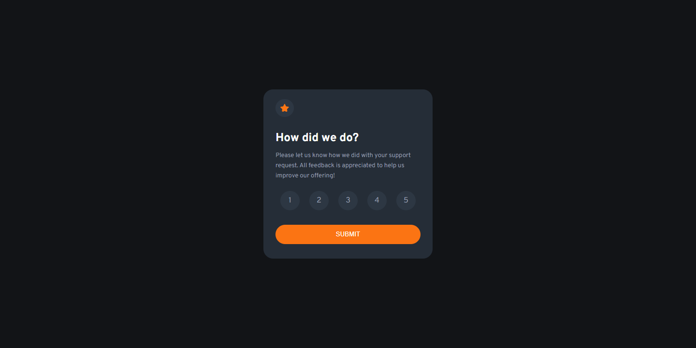
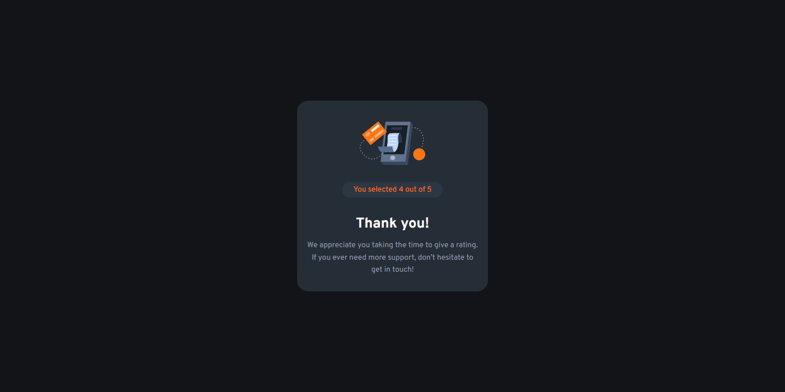
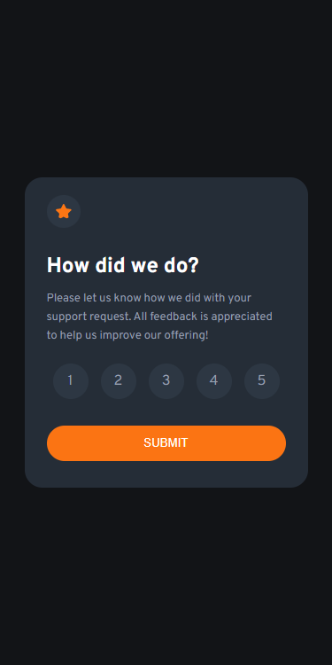
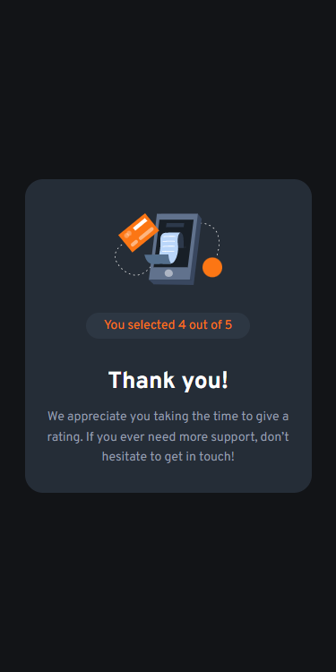

# Frontend Mentor - Interactive rating component solution

This is a solution to the [Interactive rating component challenge on Frontend Mentor](https://www.frontendmentor.io/challenges/interactive-rating-component-koxpeBUmI). Frontend Mentor challenges help you improve your coding skills by building realistic projects. 

## Table of contents

- [Overview](#overview)
  - [The challenge](#the-challenge)
  - [Screenshot](#screenshot)
  - [Links](#links)
- [My process](#my-process)
  - [Built with](#built-with)
  - [What I learned](#what-i-learned)
  - [Continued development](#continued-development)  
- [Author](#author)


## Overview

### The challenge

Users should be able to:

- View the optimal layout for the app depending on their device's screen size
- See hover states for all interactive elements on the page
- Select and submit a number rating
- See the "Thank you" card state after submitting a rating

### Screenshot










### Links

- Solution URL: [Solution URL](https://github.com/hoomi88/interactive-rating-component-main)
- Live Site URL: [Live URL](https://hoomi88.github.io/interactive-rating-component-main/)

## My process

### Built with

- Semantic HTML5 markup
- CSS custom properties
- Flexbox

### What I learned

Few new things in JavaScript:

Save and restore some state information in the browser
```js
localStorage.setItem("score", value);

var score = localStorage.getItem("score");
```
Allow selection and highlight of the score requires "un-color" the previous buttons.
This procedure was done with getting using querySelectorAll and iterating through the resulted list.
```js
var clean = document.querySelectorAll(".score");    
clean.forEach(element => {       
    element.style.backgroundColor = "#2d3743";
    element.style.color = "#959eac";
});
```

toggling between two windows can be done with styles, using display block and display none.

```html
<div class="popup" id="answer" style="display: none;">
<div class="popup" id="question" style="display: block;">
```

### Continued development

Need to check if the same project can be acheived using tailwind or bootstrap.


## Author

- Frontend Mentor - [@hoomi88](https://www.frontendmentor.io/profile/hoomi88)


